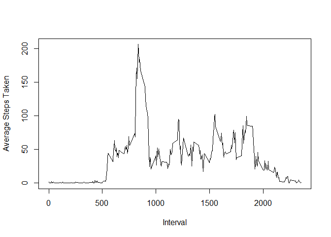
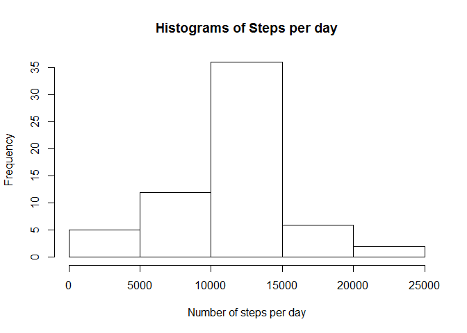
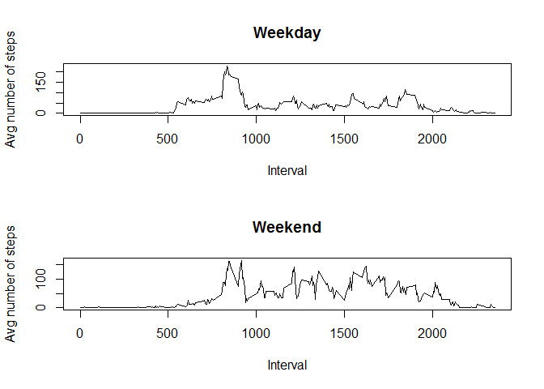

# Reproducible Research: Peer Assessment 1


## Loading and preprocessing the data


```r
require(plyr)
```

```
## Loading required package: plyr
```

```r
library(ggplot2)
data <- read.csv("activity.csv")
cleanData<-data[complete.cases(data),]
cdata <- ddply(cleanData, c("date"), summarise,sum    = sum(steps))
hist(cdata$sum,main="Histograms of Steps per day",xlab = "Number of steps per day")
```

 

## What is mean total number of steps taken per day?

### Mean and median

```r
mean<-mean(cdata$sum)
mean
```

```
## [1] 10766.19
```

```r
median<-median(cdata$sum)
median
```

```
## [1] 10765
```

The mean of the steps per day is 1.0766189\times 10^{4} and the median is 10765


## What is the average daily activity pattern?

```r
stepsPerInterval <- ddply(cleanData, c("interval"), summarise,average    = mean(steps))
plot(stepsPerInterval$interval,stepsPerInterval$average,type="l",ylab="Average Steps Taken",xlab="Interval")
```

 
## What is interval with the max average number ofsteps

```r
interval <- stepsPerInterval[stepsPerInterval$average==max(stepsPerInterval$average),"interval"]
interval 
```

```
## [1] 835
```
The interval with the maimum averagenumber of steps is 835


## Imputing missing values


```r
#The total number of NA is 
nErrObs=nrow(data)-nrow(cleanData)
```
Total number of NAs is 2304

###Description of the strategy 
For each NA i will find the average number of steps for that interval and substitute it


```r
dataSub<-data
for (i in 1:nrow(data)) {
  #if teh value is a NA find the average number in the interval and substitute it
  if(is.na(data$steps[i])){
    intervalI<-data[i,"interval"]
    meanIntervalI<-mean(stepsPerInterval[stepsPerInterval$interval==intervalI,"average"])
    dataSub[i,"steps"]<-meanIntervalI
  }
}
cdataSub <- ddply(dataSub, c("date"), summarise,sum    = sum(steps))
hist(cdataSub$sum,main="Histograms of Steps per day",xlab = "Number of steps per day")
```

 

### Mean and median

```r
meanSub<-mean(cdataSub$sum)
meanSub
```

```
## [1] 10766.19
```

```r
medianSub<-median(cdataSub$sum)
medianSub
```

```
## [1] 10766.19
```

The mean of the steps per day of teh cleaned data is 1.0766189\times 10^{4} and the median is 1.0766189\times 10^{4}
The mean of the original data and the cleaned data should be the same since I'm adding the average
The difference between the means is 0  

## Are there differences in activity patterns between weekdays and weekends?


```r
#Convert the factor variable to a date
dataSub$date=as.POSIXlt(dataSub$date)
#compute the workday
dataSub$dayOfWeek=weekdays(dataSub$date)
#calculate the factors
dataSub$weekends = factor(weekdays(dataSub$date) %in% c("Sunday","Saturday"), labels = c("weekday","weekend"))

#create the data for teh weekday and weekend plots
aggregatedDataWeekday <- ddply(dataSub[dataSub$weekends=="weekday",], c("interval"), summarise,average    = mean(steps))
aggregatedDataWeekend <- ddply(dataSub[dataSub$weekends=="weekend",], c("interval"), summarise,average    = mean(steps))


par(mfrow = c(2,1))
#first subplot
plot(aggregatedDataWeekday$interval,aggregatedDataWeekday$average,type="l",main="Weekday",ylab="Avg number of steps",xlab="Interval")
#second subplot
plot(aggregatedDataWeekend$interval,aggregatedDataWeekend$average,type="l",main="Weekend",ylab="Avg number of steps",xlab="Interval")
```

 
The results indicate that we seem to be more active during the weekends  - probably since most of us sit at work. 


